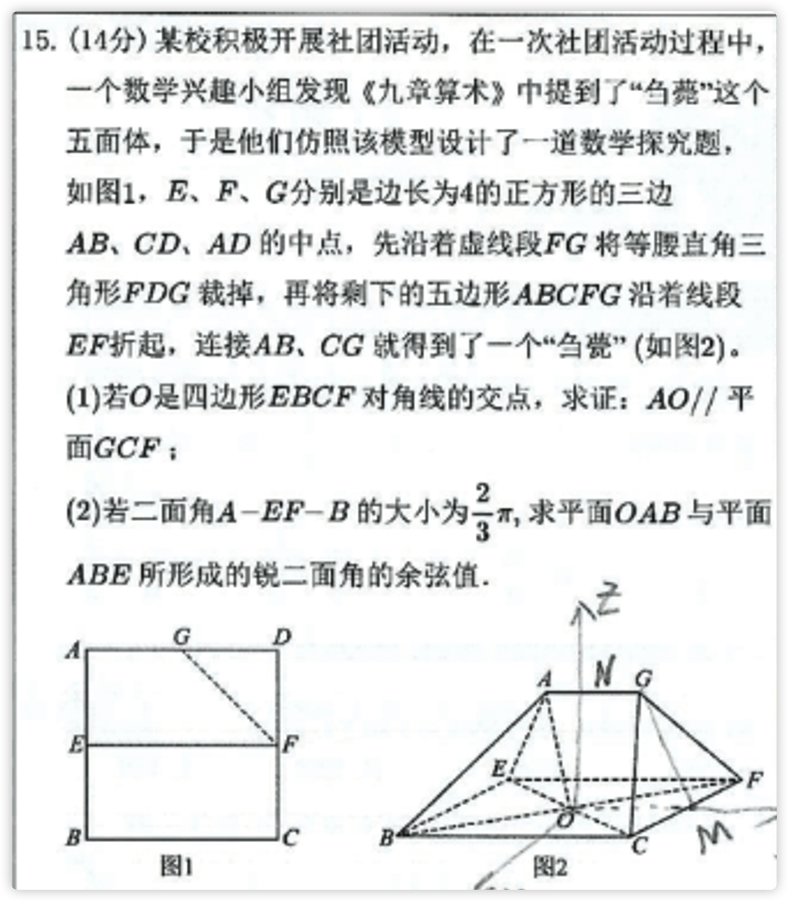

# MathLens

<div align="right">
  <a href="#chinese">中文</a> | <a href="#english">English</a>
</div>

---

<a id="chinese"></a>

# MathLens — AI 数学教学视频制作

> 将一道数学题，变成一支有声有画的教学视频。

MathLens 是一个运行在 Cursor AI 中的 **Agent Skill**。你只需粘贴一道数学题（图片或文字），它就能自动完成从题目分析、可视化讲解、配音脚本到 Manim 动画视频的全流程制作。

---

## 演示

### 输入：一道数学题截图



### 输出：带配音的 Manim 教学动画

<video src="resource/output.mp4" controls width="100%"></video>

> 提示：如视频无法预览，可直接下载 [output.mp4](resource/output.mp4) 观看。

---

## 亮点

- **全自动流水线**：8 步工作流一气呵成，无需手动拼接工具
- **深入浅出**：AI 以一对一家教的方式拆解题目，适合普通学情的学生
- **SVG 可视化讲解**：自动生成带几何标注的 HTML 文档，随时预览
- **真人感配音**：基于 edge-tts 生成自然语音，支持选择音色（默认晓晓）
- **画面音频精准同步**：`wait_for_narration(keyword)` 机制让动画在读白说出关键词时精准触发
- **几何自校验**：内置 `assert_geometry()` 验证坐标正确性，防止画出错误图形
- **Manim 动画视频**：渲染输出专业级数学教学视频

---

## 核心工作流

```
题目输入
  │
  ▼
① 数学分析      →  推导已知/结论，建立几何模型
  │
  ▼
② HTML 可视化   →  SVG 绘图 + 步骤标注，生成讲解页面
  │
  ▼
③ 分镜脚本      →  定义幕结构，设计画面 / 字幕 / 读白
  │
  ▼
④ TTS 生成      →  生成每幕 .wav 音频 + 同步点索引
  │
  ▼
⑤ 音频验证      →  校验时长，回写分镜脚本
  │
  ▼
⑥ 代码脚手架    →  生成 Manim 框架（几何建模 + 场景结构）
  │
  ▼
⑦ 动画实现      →  按分镜逐幕实现动画，对齐读白同步点
  │
  ▼
⑧ 渲染验证      →  输出视频 + 关键帧截图，失败自动修复
```

---

## 快速开始

### 前置依赖

```bash
pip install uv manim edge-tts
```

### 初始化项目

```bash
python init.py ./my_math_problem
```

### 触发 Skill

在 Cursor 对话中，直接粘贴题目图片或描述即可：

```
（粘贴数学题截图）

帮我讲解这道题，生成教学视频。
```

AI 会自动按 8 步工作流完成制作。

---

## 手动运行脚本

```bash
# 生成 TTS 音频
python scripts/generate_tts.py audio_list.csv ./audio --voice xiaoxiao

# 验证音频并回写分镜时长
python scripts/validate_audio.py 分镜.md ./audio

# 检查 Manim 代码结构
python scripts/check.py

# 渲染视频
python scripts/render.py
```

---

## 目录结构

```
MathLens/
├── README.md               # 本文档
├── SKILL.md                # Agent Skill 主文件（给 Cursor AI 读的）
├── init.py                 # 项目初始化脚本
├── resource/               # 演示素材
│   ├── input.png           # 示例输入题目
│   └── output.mp4          # 示例输出视频
├── scripts/
│   ├── generate_tts.py     # TTS 音频生成
│   ├── validate_audio.py   # 音频验证 & 分镜回写
│   ├── check.py            # Manim 代码结构检查
│   └── render.py           # 视频渲染
├── templates/
│   └── script_scaffold.py  # Manim 脚手架模板
├── references/             # 分镜脚本示例
└── sample/                 # 早期风格探索参考
```

---

## 开源协议

本项目采用 **CC BY-NC 4.0（署名—非商业性使用 4.0 国际）** 协议。

- **个人学习 / 教育用途**：免费使用，欢迎分享
- **商业用途**：须获得作者书面授权，未经授权不得用于商业目的

> [Creative Commons Attribution-NonCommercial 4.0 International](https://creativecommons.org/licenses/by-nc/4.0/)

---
---

<a id="english"></a>

# MathLens — AI Math Teaching Video Generator

> Turn a math problem into a narrated, animated teaching video.

MathLens is a **Cursor Agent Skill**. Just paste a math problem (image or text), and it automatically handles the full pipeline: problem analysis → visual explanation → voiceover scripting → Manim animation video.

---

## Demo

### Input: A math problem screenshot


### Output: Narrated Manim animation

<video src="resource/output.mp4" controls width="100%"></video>

> If the video doesn't preview, download [output.mp4](resource/output.mp4) directly.

---

## Highlights

- **Fully automated pipeline**: 8-step workflow from image to video, no manual glue needed
- **Student-friendly explanations**: AI tutors step-by-step like a 1-on-1 teacher
- **SVG visual explanations**: Auto-generates annotated HTML documents for instant preview
- **Natural-sounding voiceover**: Powered by edge-tts with selectable voices (default: Xiaoxiao)
- **Frame-accurate audio sync**: `wait_for_narration(keyword)` triggers animations exactly when the narration says the keyword
- **Geometry self-validation**: Built-in `assert_geometry()` verifies coordinates to prevent incorrect diagrams
- **Professional Manim video output**: Renders polished math teaching videos

---

## Core Workflow

```
Problem Input
  │
  ▼
① Math Analysis   →  Derive facts, build geometric model
  │
  ▼
② HTML Visual     →  SVG diagram + step annotations
  │
  ▼
③ Storyboard      →  Define scenes, design visuals / subtitles / narration
  │
  ▼
④ TTS Audio       →  Generate per-scene .wav + sync point index
  │
  ▼
⑤ Audio Validate  →  Verify durations, write back to storyboard
  │
  ▼
⑥ Scaffold        →  Generate Manim framework (geometry + scene structure)
  │
  ▼
⑦ Animation Code  →  Implement scene-by-scene, aligned to narration sync points
  │
  ▼
⑧ Render & Check  →  Output video + keyframes; auto-retry on failure
```

---

## Quick Start

### Prerequisites

```bash
pip install uv manim edge-tts
```

### Initialize a project

```bash
python init.py ./my_math_problem
```

### Trigger the Skill

In Cursor, paste a problem image or description:

```
(paste math problem screenshot)

Please explain this problem and generate a teaching video.
```

The AI will automatically run the full 8-step pipeline.

---

## Run Scripts Manually

```bash
# Generate TTS audio
python scripts/generate_tts.py audio_list.csv ./audio --voice xiaoxiao

# Validate audio and write durations back to storyboard
python scripts/validate_audio.py storyboard.md ./audio

# Check Manim code structure
python scripts/check.py

# Render video
python scripts/render.py
```

---

## License

This project is licensed under **CC BY-NC 4.0 (Attribution-NonCommercial 4.0 International)**.

- **Personal / educational use**: Free to use and share
- **Commercial use**: Requires written permission from the author

> [Creative Commons Attribution-NonCommercial 4.0 International](https://creativecommons.org/licenses/by-nc/4.0/)
